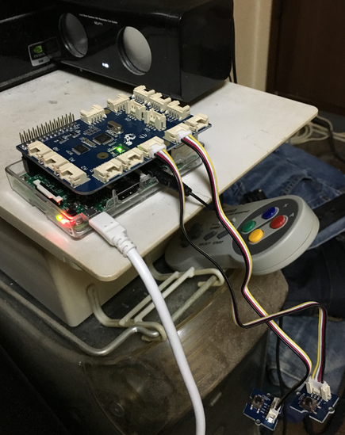

# ゆっくりが予定を喋ったり、AFN Tokyo を流したりする IoT


## 説明
Raspberry Pi 3 (以下 RPi3) に BLE やタクトスイッチなどから何かしらのアクションがあった時、iCloud 内の当日の全予定を取得し音声でお知らせします。音声なので忙しい場合でも、何かしながら予定の確認ができます。また、付録機能として AFN の再生ができます。

今回はアクションとして、お気楽極楽に GrovePi+ を使うことにしました。GrovePi+ の D2 と D3 port にボタンを接続します。D2 ボタンは iCloud Calendar を読み上げ、D3 ボタンは AFN を再生します。もし既に再生中だった場合、停止します。

RPi3 を再起動してもこのプログラムが動くように sh を追加しました。なのでこれ単体で機能します。

再生のたびに AFN のチャンネルを変更するようにしました。具体的には...

再生(Tokyo)、停止、再生(Joe)、停止、再生(Power Talk)、停止、再生(The Voice)、停止、再生(Freedom)、停止、再生(Tokyo)...

となります。




## 必要なハード
1. Raspberry Pi (Well, I use RPi3 model B.)
2. GrovePi+
3. Two buttons for Grove


## 必要なソフト
1. OS として [Raspbian for Robots](http://www.dexterindustries.com/howto/install-raspbian-for-robots-image-on-an-sd-card/) (RPi3 と素の Raspbian の組み合わせだと Grove の反応が超絶イマイチで、粗悪品のボタンを掴んだか？って勘違いするほどです。ハマりました。2016/04/12 時点で RPi3 を使うなら OS は Raspbian for Robots がオススメです。RPi2 は分かりません。)
2. Python module の pyicloud
3. テキスト読み上げソフトとして [AquesTalkPi](http://www.a-quest.com/products/aquestalkpi.html) (AquesTalkPi なら日本語もある程度の英語も設定なしで喋ってくれるので)
4. wrapper of AquesTalkPi (eg, atalk.sh) (AquesTalkPi は wav を作るだけなので aplay で再生するようにラッパーを作成)


## 導入
1. Setup [Raspbian for Robots](http://www.dexterindustries.com/howto/install-raspbian-for-robots-image-on-an-sd-card/).
2. sudo pip install pyicloud
3. Download [AquesTalkPi](http://www.a-quest.com/products/aquestalkpi.html) and unzip.
4. Create wrapper (eg, vi atalk.sh).
5. git clone git@github.com:tkumata/speakEvents.git
6. touch /home/pi/.pyicloud && chmod 600 /home/pi/.pyicloud && vi /home/pi/.pyicloud (Please see below.)
7. Adjust "speakEvents.py" (eg, path etc...)
8. sudo cp speakEventsService.sh /etc/init.d/
9. sudo update-rc.d speakEventsService.sh defaults


- example atalk.sh

AquesTalkPi が作った wav データを再生する wrapper の例です。
```
#!/bin/bash
aquestalkpi=/home/pi/bin/aquestalkpi/AquesTalkPi
var=`$aquestalkpi "$@" | base64; echo ":${PIPESTATUS[0]}"`
ret=(${var##*:})
data=${var%:*}
if [ $ret -eq 0 ]; then
  echo $data | base64 --decode --ignore-garbage | aplay -q
else
  echo $data | base64 --decode --ignore-garbage
  exit $ret
fi
```


- /home/pi/.pyicloud format

pyicloud を使うための設定ファイルの形式です。
```
[account]
user = yourappleid@example.com
pass = your_appleid_password
```


## 予定
- ロータリーかスライダーで AFN のチャンネルを選択できるようにしたい。
- 折角の RPi3 なので BLE でコントロールできるようにしたい。


## ライセンス
MIT


## 著者
tkumata
