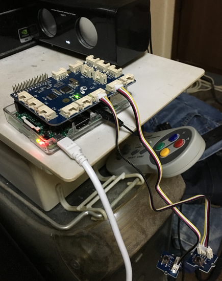

# ゆっくりが予定や天気情報を喋ったり、AFN 360 を再生したりする IoT


## Description

Raspberry Pi 3 (以下 RPi3) に BLE やボタンなどから何かしらの入力があった時、以下のことをします。

 - tenki.jp の天気情報を音声でお知らせ
 - iCloud 内の当日の全予定を音声でお知らせ
 - AFN 360 の再生 (RGB LED でチャンネル毎に色を変える)
 - RGB LED を 40 秒点灯 (暗い部屋用の一時的なトーチ)

音声なので忙しい場合でも、何かしながら予定の確認ができます。

今回はお気楽極楽に、入力として GrovePi+ を使うことにしました。GrovePi+ の

| Port | Device            | Role                                   | Notes   |
|------|:-----------------:|:--------------------------------------:|:--------|
| D2   | Encoder           | インターネットラジオのチャンネルの変更 | D2 only | 
| D4   | Button            | 天気情報と iCloud Calendar を読み上げ  ||
| D5   | Button            | インターネットラジオの再生、停止       ||
| D6   | Button            | LED のボタン                           | threading で 40 秒だけ点灯させる |
| D7   | Chainable RGB LED | チャンネルの表現                       ||
| D8   | Normal LED        | ボタンを押した時のフィードバック用     ||

AFN のチャンネルは Encoder の...

| Step | Channnel   | Color        | Timer |
|------|:----------:|:------------:|:------|
| 0    | 超 A&G     | 何か一意な色 | None  |
| 1    | Tokyo      | 何か一意な色 | None  |
| 2    | Joe Radio  | 何か一意な色 | None  |
| 3    | Power Talk | 何か一意な色 | None  |
| 4    | The Voice  | 何か一意な色 | None  |
| 5    | Freedom    | 何か一意な色 | None  |
| 6-24 | Joe Radio  | 何か一意な色 | |

となります。色は配列の順番を種として特定のアルゴリズムで一意な色を自動的に生成されます。

[](images/IMG0054.m4v)


## Hardware

1. Raspberry Pi 3
2. GrovePi+ (IMPORTANT!! Firmware is v1.2.6)
3. Buttons for Grove (D4, D5, D6)
4. Chainable RGB LED (D7)
5. LED (D8)
6. Encoder (D2) (IMPORTANT!! Grove Encoder works on D2 port only.)


## Software

1. OS として [Raspbian for Robots](http://www.dexterindustries.com/howto/install-raspbian-for-robots-image-on-an-sd-card/) (RPi3 と素の Raspbian の組み合わせだと Grove の反応が超絶イマイチで、粗悪品のボタンを掴んだか？って勘違いするほどです。ハマりました。2016/04/12 時点で GrovePi+ と RPi3 の組み合わせを使うなら OS は Raspbian for Robots がオススメです。RPi2 は分かりません。)
2. Python module の pyicloud
3. テキスト読み上げソフトとして [AquesTalkPi](http://www.a-quest.com/products/aquestalkpi.html) (AquesTalkPi なら日本語も喋ってくれるし、英語もアルファベット読みにならないので。)
4. Wrapper for AquesTalkPi (eg, atalk.sh) (AquesTalkPi は wav を作るだけなので aplay で再生するようにラッパを作成する必要があります。)
5. GrovePi+ Firmware v1.2.6.


## Installation

1. Setup [Raspbian for Robots](http://www.dexterindustries.com/howto/install-raspbian-for-robots-image-on-an-sd-card/).
2. sudo pip install pyicloud
3. Download [AquesTalkPi](http://www.a-quest.com/products/aquestalkpi.html) and unzip.
4. Create wrapper (eg, vi atalk.sh).
5. git clone git@github.com:tkumata/speakEvents.git
6. touch /home/pi/.speakevents && chmod 600 /home/pi/.speakevents && vi /home/pi/.speakevents (Please see below.)
7. Adjust "speakEvents/speakEvents.py" (eg, path etc...)
8. sudo cp speakEvents/speakEventsService.sh /etc/init.d/
9. sudo update-rc.d speakEventsService.sh defaults
10. sudo /etc/init.d/speakEventsService.sh start


## Notes

### atalk.sh

This is example of wrapper script which plays wav file which AquesTalkPi makes.

```
#!/bin/bash
aquestalkpi=/home/pi/bin/aquestalkpi/AquesTalkPi
var=`$aquestalkpi "$@" | base64; echo ":${PIPESTATUS[0]}"`
ret=(${var##*:})
data=${var%:*}
if [ $ret -eq 0 ]; then
  echo $data | base64 --decode --ignore-garbage | aplay -q
else
  echo $data | base64 --decode --ignore-garbage
  exit $ret
fi
```


### .speakevents Format

This is format of config file which pyicloud uses. This program supports only tenki.jp as weather information.

```
[account]
user = yourappleid@example.com
pass = your_appleid_password

[weatherurls]
weather1 = http://www.tenki.jp/forecast/3/16/
weather2 = http://www.tenki.jp/forecast/3/16/4410/13112-daily.html
```


### Firmware patch for v1.2.6

I am happy to my pull request was allowed. So this program works on public firmware v1.2.6. However if you want to build firmware yourself, please see following. At your own risk.

### Compile firmware v1.2.6 and install

Raspbian for Robots jessie contains Arduino IDE 1.6.0. But ino can run on only Arduino 1.0.x so you shuold compile firmware by Arduino IDE 1.6.0.

```
1. vi /home/pi/.arduino15/preferences.txt and add following line.
build.path=/home/pi/Arduino/temp

2. Open Arduino IDE 1.6.0
3. Open directory (/home/pi/Desktop/GrovePi/Firmware/Source/v1.2/grove_pi_v1_2_6)
4. Verify/Compile
5. cd /home/pi/Arduino/temp
6. avrdude -c gpio -p m328p -U flash:w:grove_pi_v1_2_6.cpp.hex
```

If you want to use Arduino IDE 1.6.11 so you should select boards version 1.6.11.

```
1. Open Arduino IDE 1.6.11
2. Open "Boards Manager"
3. Install "Arduino AVR Boards by Arduino version 1.6.11". DO NOT select 1.6.12 or 1.6.13.
4. Open directory /home/pi/Desktop/GrovePi/Firmware/Source/v1.2/grove_pi_v1_2_6
5. Export compiled binary
6. cd /home/pi/Desktop/GrovePi/Firmware/Source/v1.2/grove_pi_v1_2_6
7. avrdude -c gpio -p m328p -U flash:w:grove_pi_v1_2_6.ino.standard.hex
```


## Hope

- I hope that I controll functions by RPi3 built-in BLE instead of physical bottoms.
- I hope add function that speaks news headline.


## Other Version

- [wheezy](https://github.com/tkumata/speakEvents/tree/wheezy)
- [ver2](https://github.com/tkumata/speakEvents/tree/ver2x)
- [ver1](https://github.com/tkumata/speakEvents/tree/ver1x)


## License

MIT


## Author
tkumata
